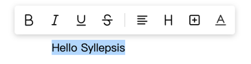

# Float toolbar (`toolbarInline`)



> Positioning rules
>
> - Display when there is text content, and display at the top of the selection area first
> - When selecting across rows, it will be displayed above or below according to the position where the mouse is released
> - Drag to select. Where mouse released far from the selection, it will be displayed at the position where the mouse is released first, and keep the left and right positions
> - In other cases where there is a selection area but no toolbar, appear when moved, centered on the mouse position

- The constructor `Ctor` of the follow-up toolbar is provided by `SylEditor` and import from `@syllepsis/editor`

```typescript
import {ToolbarInlineLoader} from'@syllepsis/editor';
import {SylEditor} from'@syllepsis/access-react';

  <SylEditor
    module={
      toolbar: {
        Ctor: ToolbarInlineLoader,
        option: {...}
      }
    }
  />
```

- `option` configuration is as follows:

| Configuration | Type                                                               | Description                                                                                         |
| ------------- | ------------------------------------------------------------------ | --------------------------------------------------------------------------------------------------- |
| tools         | `Array<string \|'\|'>`                                             | The plug-ins displayed in the toolbar.<br/> - `string`: plugin icon name <br> - `\|`: dividing line |
| Component     | `any`                                                              | Optional, rendering function                                                                        |
| tooltips      | `{ name: string }`                                                 | Optional, the tip displayed when hovering to the button                                             |
| icons         | `Types.StringMap<any>`                                             | Optional, the icon component of the button, the key is the plug-in name                             |
| tipDirection  | `'up' \|'left' \|'down' \|'right'`                                 | Optional, currently only valid for vertical buttons                                                 |
| tipDistance   | `number`                                                           | Optional, tooltipTip margin of the button                                                           |
| onToolClick   | `(editor: SylApi, name: string) => void`                           | Optional, button click callback                                                                     |
| utils         | `{ name: IToolbarUtil }`                                           | Optional, buttons attached to the toolbar, register through this configuration                      |
| trigger       | `'click' \|'hover'`                                                | Optional, drop-down menu trigger mode                                                               |
| menuDirection | `'up' \|'down' \|'up-start' \|'down-start'`                        | Optional, drop-down menu location                                                                   |
| menuDistance  | `number`                                                           | Optional, the distance between the menu and the button                                              |
| threshold     | `{ top?: number; left?: number; right?: number; bottom?: number }` | Optional, the minimum margin of the toolbar from the editor                                         |
| judgeShow     | `(editor: SylApi) => boolean`                                      | Optional, judge whether to display the toolbar                                                      |
| zIndex        | `number`                                                           | Optional, the z-index of the toolbar dom                                                            |

- Built-in `command`
  Mount method on `editor.command.toolbarInline`

| Method     | Type            | Description                             |
| ---------- | --------------- | --------------------------------------- |
| show       | `() => void`    | Show toolbar, or force refresh position |
| hide       | `() => void`    | Hide Toolbar                            |
| enable     | `() => void`    | Enable toolbar                          |
| disable    | `() => void`    | disable toolbar                         |
| getVisible | `() => boolean` | Get toolbar display status              |

Configuration example:

```typescript
import {BoldPlugin, ToolbarInlineLoader} from'@syllepsis/plugins';
import {SylEditor} from'@syllepsis/access-react';

  <SylEditor
    module={
      toolbar: {
        Ctor: ToolbarInlineLoader,
        option: {
          tools: ['bold','|']
        }
      }
    }
  />
```
